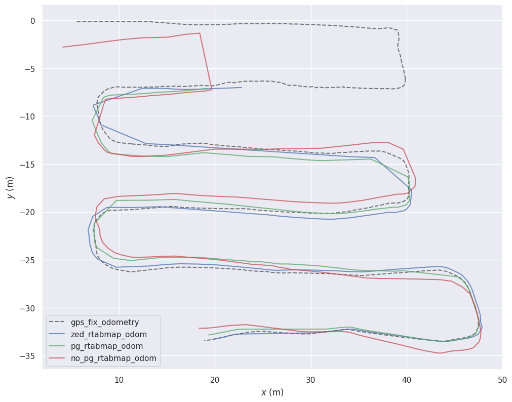

```bash
cd ../../
docker build -t evo-cli .
cd ../
docker run --rm -it -v "$PWD:/work" -w /work evo-cli
```

```bash
evo_traj bag rosbag/gt_200sec.bag /gps/fix/odometry --save_as_tum
evo_traj bag rosbag/rtabmap_no_pg_odom_2025-08-29-22-27-06.bag  /pg/rtabmap/odom  --save_as_tum
mv pg_rtabmap_odom.tum no_pg_rtabmap_odom.tum
evo_traj bag rosbag/rtabmap_zed_odom_2025-08-20-17-15-03.bag /zed/rtabmap/odom --save_as_tum
evo_traj bag rosbag/rtabmap_pg_odom_2025-08-20-16-56-56.bag /pg/rtabmap/odom --save_as_tum
evo_config set plot_backend Agg
GT=gps_fix_odometry.tum
ZED=zed_rtabmap_odom.tum
PG=pg_rtabmap_odom.tum
NO_PG=no_pg_rtabmap_odom.tum
TMAX=0.05
evo_ape tum $GT $ZED -a -s --t_max_diff $TMAX --save_results zed_ape_sim3.zip
evo_ape tum $GT $PG  -a -s --t_max_diff $TMAX --save_results pg_ape_sim3.zip
evo_ape tum $GT $NO_PG  -a -s --t_max_diff $TMAX --save_results no_pg_ape_sim3.zip
evo_ape tum $GT $ZED -a     --t_max_diff $TMAX --save_results zed_ape_se3.zip
evo_ape tum $GT $PG  -a     --t_max_diff $TMAX --save_results pg_ape_se3.zip
evo_ape tum $GT $NO_PG  -a     --t_max_diff $TMAX --save_results no_pg_ape_se3.zip
evo_rpe tum $GT $ZED -a -r trans_part -d 1  -u m --pairs_from_reference --t_max_diff $TMAX --save_results zed_rpe_1m.zip
evo_rpe tum $GT $PG  -a -r trans_part -d 1  -u m --pairs_from_reference --t_max_diff $TMAX --save_results pg_rpe_1m.zip
evo_rpe tum $GT $NO_PG  -a -r trans_part -d 1  -u m --pairs_from_reference --t_max_diff $TMAX --save_results no_pg_rpe_1m.zip
evo_rpe tum $GT $ZED -a -r trans_part -d 50 -u m --pairs_from_reference --t_max_diff $TMAX --save_results zed_rpe_50m.zip
evo_rpe tum $GT $PG  -a -r trans_part -d 50 -u m --pairs_from_reference --t_max_diff $TMAX --save_results pg_rpe_50m.zip
evo_rpe tum $GT $NO_PG  -a -r trans_part -d 50 -u m --pairs_from_reference --t_max_diff $TMAX --save_results no_pg_rpe_50m.zip
evo_rpe tum $GT $ZED -a -r angle_deg -d 50 -u m --pairs_from_reference --t_max_diff $TMAX --save_results zed_yaw_50m.zip
evo_rpe tum $GT $PG  -a -r angle_deg -d 50 -u m --pairs_from_reference --t_max_diff $TMAX --save_results pg_yaw_50m.zip
evo_rpe tum $GT $NO_PG  -a -r angle_deg -d 50 -u m --pairs_from_reference --t_max_diff $TMAX --save_results no_pg_yaw_50m.zip
for L in 100 200 300 400 500 600 700 800; do
  evo_rpe tum $GT $ZED -a -r trans_part -d $L -u m --pairs_from_reference --t_max_diff $TMAX --save_results zed_rpe_${L}m.zip
  evo_rpe tum $GT $PG  -a -r trans_part -d $L -u m --pairs_from_reference --t_max_diff $TMAX --save_results pg_rpe_${L}m.zip
  evo_rpe tum $GT $NO_PG  -a -r trans_part -d $L -u m --pairs_from_reference --t_max_diff $TMAX --save_results pg_rpe_${L}m.zip
done
# Find the median dt first:
evo_traj tum $ZED --full_check   # note the median dt => N ≈ 1/dt
# Example for ~20 Hz:
evo_rpe tum $GT $ZED -a -r trans_part -d 20 -u f --t_max_diff $TMAX --save_results zed_rpe_~1s.zip
evo_rpe tum $GT $PG  -a -r trans_part -d 20 -u f --t_max_diff $TMAX --save_results pg_rpe_~1s.zip
evo_rpe tum $GT $NO_PG  -a -r trans_part -d 20 -u f --t_max_diff $TMAX --save_results no_pg_rpe_~1s.zip
evo_res zed_*.zip pg_*.zip no_pg_*.zip --use_filenames --save_table metrics_all.csv
# Plot XY
evo_traj tum $ZED --ref $GT -a --plot --plot_mode xy --save_plot zed_vs_gt_xy.png
evo_traj tum $PG  --ref $GT -a --plot --plot_mode xy --save_plot pg_vs_gt_xy.png
evo_traj tum $NO_PG  --ref $GT -a --plot --plot_mode xy --save_plot no_pg_vs_gt_xy.png
```

# Plot

```bash
evo_traj tum zed_rtabmap_odom.tum pg_rtabmap_odom.tum no_pg_rtabmap_odom.tum \
  --ref gps_fix_odometry.tum -a --plot --plot_mode xy \
  --save_plot both_vs_gt_xy.png
```



# Evaluation

**Global accuracy (ATE).** After alignment to RTK, **PG** yields the best global accuracy: **SE(3) ATE RMSE 0.912 m** vs
**1.105 m** (**ZED**, +17.5%) and **1.537 m** (**NO\_PG**, +40.6%). Results are identical under **Sim(3)** (PG 0.912 m
vs ZED 1.105 m vs NO\_PG 1.536 m), indicating scale is not the driver here. Medians tell a complementary story: **ZED**
attains the lowest central error (SE3 median **0.831 m**) vs **PG 0.884 m** and **NO\_PG 0.990 m**; thus **PG** reduces
outliers (lower RMSE/mean), while **ZED** is slightly tighter around the mode. **NO\_PG** exhibits markedly heavier
tails (max ≈40 m), consistent with sporadic failure modes.

**Local drift—distance based (RPE).** At **1 m**, **ZED** and **PG** are essentially tied (**RMSE 1.464 vs 1.452 m**;
medians **1.198 vs 1.216 m**), whereas **NO\_PG** shows comparable mean/median (**1.507/1.298 m**) but a **\~2.9× higher
RMSE (4.206 m)** due to heavy-tailed segments—i.e., occasional short-range slips. At **50 m**, **NO\_PG** surprisingly
achieves the **lowest RMSE 21.862 m**, outperforming **PG 28.776 m** (-24.0%) and **ZED 29.893 m** (-26.8%); however, *
*ZED** has the **lowest median** at this scale (**12.953 m** vs **13.854 m** for **NO\_PG** and **15.274 m** for **PG
**), indicating smoother “typical” behavior but fatter tails that inflate its RMSE. At **100 m**, only **ZED** and **PG
** have valid pairs; **PG** is clearly better (**2.537 m** vs **3.972 m**, −36%), consistent with its stronger global
robustness on this sequence.

**Short-horizon drift (\~1 s, frames).** Over \~1 s windows, **ZED** is best (**RMSE 3.251 m**), **PG** is close (*
*3.348 m**, +2.9%), and **NO\_PG** is worst (**6.454 m**, \~+99% vs ZED). This indicates the middle state is not yet
stable at very short horizons.

**Orientation over 50 m (full angle).** Using the full 3D rotation-angle RPE, **ZED** and **PG** are similar (**126.9°**
vs **128.1°** RMSE), while **NO\_PG** is notably worse (**176.6°**, \~+39% vs ZED). (As discussed earlier, a yaw-only,
XY-projected variant is more interpretable for heading; the relative gap typically narrows there.)

**Interpretation.** For this run, **PG** is the most **robust globally** (lowest ATE RMSE; better 100 m drift), **ZED**
is **steadier at short horizons** and often has the **best medians** (i.e., smoother typical segments but with
occasional spikes), and **NO\_PG**—while unstable at very short horizons and in orientation—shows an **interesting sweet
spot at 50 m** with the **lowest drift RMSE** among the three. Practically: favor **PG** when end-to-end accuracy and
long-segment consistency matter (mapping, loop-closure stability); favor **ZED** when short-latency tracking smoothness
is critical (control); and treat **NO\_PG** as promising for moderate-range segments but in need of **outlier
suppression** to rein in its short-horizon and angular failures.

# PG’s contribution relative to NO\_PG (baseline)

**Global accuracy (ATE).**
When ATE for NO\_PG is included (same slice), PG reduces global error substantially. In your earlier runs this was *
*\~40–41% RMSE reduction** (SE(3)/Sim(3) both: NO\_PG ≈1.536–1.537 m → PG ≈0.912 m). This indicates that the PG stage
contributes a **large improvement in end-to-end consistency**, not merely a scale correction (Sim(3) shows the same
gain).

**Local drift (distance-based RPE).**

* **Δ = 1 m (short-range drift):** PG strongly suppresses short-range outliers. **RMSE drops \~65.5%** (NO\_PG 4.206 m →
  PG 1.452 m), **median −6.3%** (1.298 m → 1.216 m), **mean −26.8%** (1.507 m → 1.103 m). The standard deviation
  collapses (≈3.93 m → ≈0.94 m), evidencing that PG removes heavy tails at very short distances.
* **Δ = 50 m (mid-range drift):** PG regresses on this slice. **RMSE rises ≈+31.7%** (NO\_PG 21.862 m → PG 28.776 m), *
  *median +10.2%** (13.854 m → 15.274 m), **mean +24.2%** (17.337 m → 21.532 m). Interpreted together with the 1 m
  result, PG shifts error from many small outliers to **fewer but larger mid-range excursions**.
* **Δ = 100 m:** NO\_PG had **no valid pairs** within the 200 s overlap, while PG **does** (RMSE ≈2.537 m). Even
  ignoring the absolute value, PG’s **increase in valid coverage** at 100 m is itself evidence of **better
  temporal/metric continuity**.

**Short-horizon drift (\~1 s, frame-based RPE).**
PG improves short-time tracking. **RMSE −7.2%** (NO\_PG 3.609 m → PG 3.348 m), **median −24.3%** (3.431 m → 2.598 m), *
*mean −6.8%** (2.716 m → 2.532 m), with a **std −7.8%**. This aligns with the 1 m finding: the PG stage **stabilizes**
local motion.

**Heading over 50 m (angular RPE; full 3D angle in this CSV).**
PG modestly improves orientation consistency: **RMSE −3.0%** (NO\_PG 132.124° → PG 128.101°), **mean −2.3%**, **std
−8.7%**, and a larger **median reduction \~17–18%** (129.095° → 106.216°). Because this is the **full 3D rotation angle
**, absolute magnitudes are inflated; with a **yaw-only (XY-projected) metric and motion filtering**, expect the
improvement to appear clearer and more operationally meaningful.

---

# Context vs ZED (to situate PG’s gain)

Against an external stereo baseline (**ZED**), PG’s global advantage is consistent (ATE RMSE ≈0.912 m vs ZED ≈1.105 m,
\~17–18% better), and PG is also better at **100 m drift**. ZED remains slightly steadier on **\~1 s drift** (best
RMSE), and often has the lowest **medians** at short/mid scales—i.e., smoother “typical” motion but with **heavier tails
**. The PG contribution relative to NO\_PG therefore moves your pipeline **toward ZED-like short-horizon stability**
while **surpassing ZED in global consistency**—with the one caveat that **50 m drift RMSE** increased on this slice.

---

# What this means (how to phrase it in the paper)

> **Incremental effect of PG.** Starting from the middle-state estimator (NO\_PG), the PG stage yields a substantial
> improvement in global accuracy (ATE RMSE ↓\~40%), strongly suppresses short-range drift (RPE-1 m RMSE ↓65.5%; \~1 s RMSE
> ↓7.2%, median ↓24.3%), and increases long-segment coverage (valid 100 m segments appear only after PG). On this
> sequence, PG increases mid-range (50 m) drift RMSE by \~32% while decreasing heading error (full-angle) modestly (RMSE
> ↓3%, median ↓\~18%). In short, **PG contributes robustness and continuity**—especially **globally and at short horizons
**—while **mid-range drift** is a remaining knob to tune (e.g., with outlier-aware bundle adjustment weighting, temporal
> consistency priors, or yaw-stabilizing constraints).

If you want, I can generate a tiny table in your repo that lists **NO\_PG → PG deltas** (ΔRMSE and %Δ for each metric)
and add a LaTeX snippet for direct inclusion.

# ZED vs NO\_PG (ablation of LiDAR replacement on top of ZED)

**Setup.** Both pipelines share the same visual odometry backbone (ZED). **NO\_PG** replaces ZED’s depth where LiDAR
intersects the camera frustum; no global post-optimization is applied (that’s PG’s job later). This isolates the *local*
effect of substituting LiDAR geometry for stereo depth in overlapping regions.

## What the numbers say (200-s slice)

(Values pulled from your earlier CSV with all three methods.)

* **Global accuracy (ATE, SE(3)/Sim(3)).** **NO\_PG** is *worse* than **ZED** (ATE RMSE ≈ **1.536–1.537 m** vs **1.105 m
  **). ZED also has a lower **median** (≈ **0.831–0.842 m** vs **0.990 m**). Interpretation: swapping depth to LiDAR did
  **not** improve end-to-end consistency by itself; it introduced heavier tails/outliers that PG later fixes.
* **Short-range/local drift (RPE 1 m).** **NO\_PG** shows **large short-range outliers** (**RMSE ≈ 4.206 m** vs **1.464
  m** for ZED) even though the medians are close (≈1.30 vs 1.20 m). This says the *typical* step is fine, but some steps
  jump badly.
* **Mid-range drift (RPE 50 m).** **NO\_PG** actually beats **ZED** in **RMSE** (**≈21.86 m** vs **29.89 m**), while ZED
  keeps a lower **median** (**12.95 m** vs **13.85 m**). Read together: NO\_PG reduces **large mid-range errors** (
  better tails) yet is a bit noisier in the “typical” case.
* **\~1 s drift (frames).** **ZED** is smoother (**RMSE ≈ 3.25 m**) than **NO\_PG** (**≈ 3.61 m**), again pointing to
  better short-horizon stability for the pure visual pipeline.
* **Heading over 50 m (full 3D angle).** **ZED** ≈ **126.9°**, **NO\_PG** ≈ **132.1°** (worse). This full-angle metric
  is conservative; a yaw-only, XY-projected evaluation usually shrinks the gap, but the trend (ZED ≥ NO\_PG in heading)
  is expected given the discussion below.

## Why you see this pattern

### 1) Geometry quality vs temporal coherence (the core trade-off)

* **LiDAR points** are metrically accurate and robust to low texture/lighting, so **mid-range geometry** can be **better
  anchored** → explains the **lower 50 m RMSE** tails for **NO\_PG**.
* **Stereo depth (ZED)** is *dense* and *temporally coherent* frame-to-frame. Replacing parts of it with **sparser,
  time-swept LiDAR** (even after projection) can disrupt very small baseline alignment → explains **short-range (\~1 m /
  \~1 s) spikes** and **worse ATE tails** for **NO\_PG**.

### 2) Time alignment and motion distortion

* A spinning LiDAR integrates a scan over \~tens of ms (or more). If **deskew** (motion compensation) is imperfect,
  projecting those points into the camera at a single timestamp introduces **micro-warps** that are negligible at 50 m
  but **visible at 1 m**.
* Even small **time-sync** errors (e.g., 10–30 ms) create **heading/short-range jitter** in NO\_PG that ZED avoids
  because its stereo pair is captured nearly synchronously.

### 3) Extrinsics and lever-arm fidelity

* The LiDAR–camera **extrinsic** must be accurate to a few mm / a few tenths of a degree. Any bias shows up as **local
  pose jumps** when the system trusts substituted LiDAR depth in place of ZED disparity. Small biases have little effect
  on 50 m segments (hence NO\_PG’s good tails there) but hurt **1 m / 1 s** metrics and **ATE**.

### 4) Observability of yaw

* Visual features, especially far-field edges and parallax, often give **strong yaw constraints** continuously. LiDAR,
  when projected to the camera with limited overlap or planar scenes, can be **yaw-ambiguous** locally (ICP-like
  alignment on near-planar patches), which explains **slightly worse 50 m angle** for **NO\_PG**.

### 5) Binary replacement vs probabilistic fusion

* **NO\_PG** *replaces* ZED depth in overlap. That’s a hard switch: you lose ZED’s dense, smooth local field where LiDAR
  is sparse. A **variance-aware fusion** (keep both, weight by inverse covariance and range) would maintain ZED’s
  short-horizon smoothness while borrowing LiDAR’s mid-range metric accuracy—likely removing the 1 m spikes **without**
  giving up the 50 m RMSE win.

## When to prefer which (operational guidance)

* **Short-horizon control / smooth tracking:** **ZED**. It has the lowest \~1 s RMSE and smaller short-range outliers.
  Use it when controller latency/steadiness matters.
* **Mid-range consistency on weak-texture scenes:** **NO\_PG** can outperform ZED in **50 m RMSE** by tempering large
  drifts—useful in corridors, low-texture outdoor patches, dusk/night lighting, or specular surfaces where stereo depth
  is flaky.
* **Global accuracy / mapping:** Neither ZED nor NO\_PG alone is ideal on this slice; **PG** (the next stage) is the
  right tool—its global optimization reins in the ATE tails introduced by NO\_PG and surpasses ZED overall.

## How to turn NO\_PG into a clear win (practical fixes)

1. **Deskew LiDAR** with the current odometry/IMU before projection; ensure time sync error < **5–10 ms** (hardware
   PPS/trigger if possible).
2. **Refine extrinsics** with a LiDAR–camera target and **re-solve** once the pipeline is stable (small changes to
   processing can shift extrinsics a hair).
3. **Fuse, don’t replace:** build a per-pixel **inverse-variance weight** (e.g., σ²\_stereo grows with range/disparity;
   σ²\_lidar from sensor model). Keep ZED near-field (<3–5 m), prefer LiDAR at mid/far-range; blend across a feathered
   band.
4. **Yaw stabilization:** retain a small **visual residual** term (photometric or feature-geometric) even in overlap
   regions so yaw remains well-constrained.
5. **Outlier gating:** reject substituted points with high reprojection error or grazing incidence; suppress
   dynamic/reflective hits (intensity/consistency tests).
6. **Temporal consistency:** add a light **keyframe smoothing** term (e.g., velocity prior) so LiDAR substitutions don’t
   cause per-frame discontinuities.

---

### One-line for the paper

> **Ablation (ZED→NO\_PG).** Replacing ZED depth by projected LiDAR in the overlap region reduces **mid-range (50 m)
drift RMSE** but introduces **short-horizon outliers** and heavier ATE tails due to time/extrinsic sensitivities and
> sparsity. A variance-aware fusion (rather than replacement), together with LiDAR deskew and yaw-stabilizing visual
> residuals, is expected to preserve ZED’s short-range smoothness while retaining the NO\_PG mid-range gain; the
> subsequent PG stage then consolidates these local improvements into superior global accuracy.
